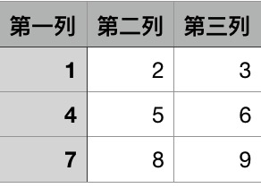

# This is simple program for markdown table generate.


- 因为在写markdown的时候需要展示表格，这就需要csv里的数据转换成markdown表格，
在网上找了些在线转换的网站，效果不尽人意，于是决定自己造轮子，主程序代码也就几十行，
很简单的一个程序.

## Usage

- Usage pattern, e.g.:
```
Usage:
  genMdTable.py [options] <filename>
  genMdTable.py [options] <filename> [-o] <outfile>
  genMdTable.py <filename> [-o] <outfile>
  genMdTable.py (-v|--version)
  genMdTable.py (-h|--help)
```

- Option descriptions, e.g.:
```
Options:
  -h --help      帮助
  -v --version   显示版本号.
  -r --right     markdown文档，右对齐
  -l --left      markdown文档，左对齐
  -c --center    markdown文档，居中(默认)
  -o --outfile   输出文件(默认打印终端上)
```

## Example.


- ``python3 genMdTable test.csv`` 




## Download
```
git clone https://github.com/Aderlx/markdown-table-generate.git

```

- python3
- pip install docopt

___
<br>
<br>

- v0.1.0 基础版本
